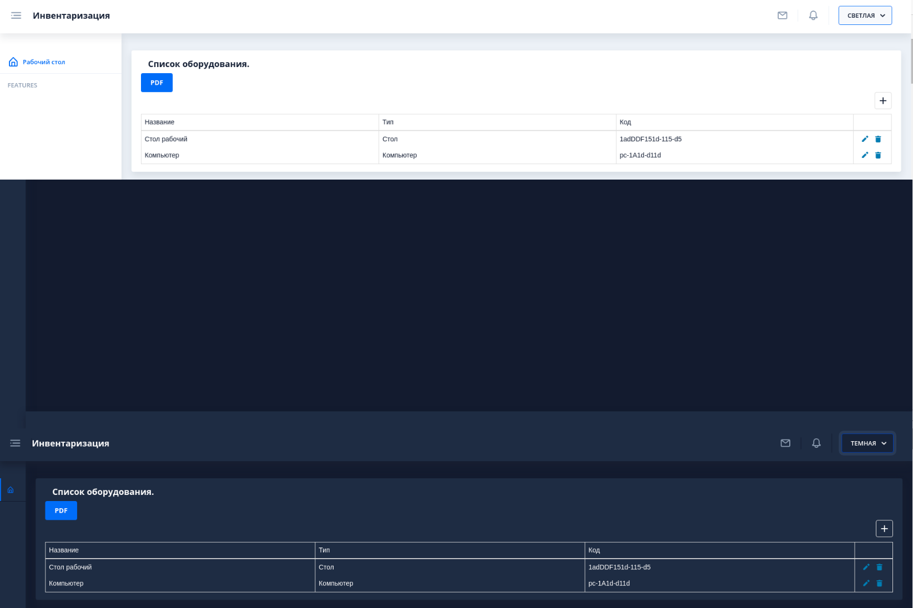
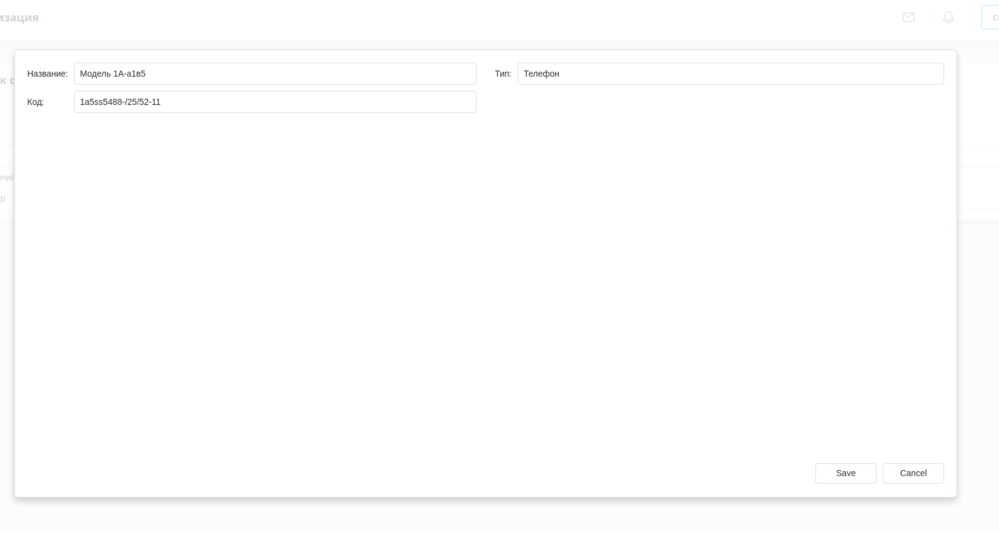
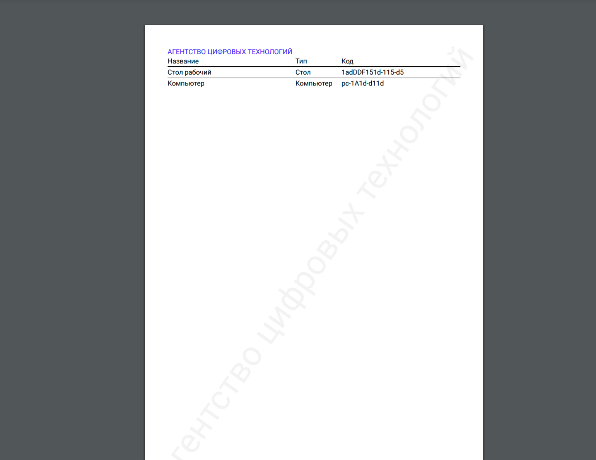

# Inventory [Demo](https://digital-technology-agency.github.io/equipment-inventory/)
This is a check of the availability of the organization's property and the state
 of its financial obligations as of a certain date by comparing actual data with
  accounting data. This is the main way to actually control the safety of property
   values and funds.

[Агентство цифровых технологий](https://dta.agency)

 

[Разработка программного обеспечения](https://dta.agency/)

### Facilities

## UI

### Main window

### Create item

### Export to pdf

